InformeLaboratorioNo5
==========================
# PRÁCTICA No. 5 TEOREMA DE THÉVENIN
1. OBJETIVOS
* 1.1 OBJETIVO GENERAL

Implementar el conocimiento de superposición tanto teóricamente y prácticamente con el uso de herramientas que le permitan diseñar circuitos de una forma digital con lo cual se analizara tanto los resultados calculados como simulados 

* 1.2 OBJETIVOS ESPECIFICOS
  * Analizar circuitos mediante superposición
  * diseñar circuitos de tal manera que se facilita su resolución 
  * similar circuitos mediante una herramienta digital 
  * Comparar resultados simulados y calculados 

2. REQUISITOS PREVIOS

Se requiere el análisis analítico del circuito mostrado en la figura 4.1., aplicando el Teorema de Superposición. Obtenga los valores de VA e IX, respetando tanto la   polaridad del voltaje como el sentido de la corriente que se proporcionan y anote los resultados en la tabla 4.1. y 4.2. según corresponda.

3. INFORMACION GENERAL 

Los simuladores de circuitos electrónicos son muy útiles para explicar el comportamiento de éstos de una forma asequible a los alumnos de la rama de Eléctrica y Electrónica. El uso de la simulación por ordenador es una herramienta imprescindible hoy en día a la hora de explicar la electrónica en el aula, al ser la forma más sencilla y rápida de comprobar el funcionamiento de un circuito. Además, no necesita ningún tipo de material adicional para el montaje del mismo o medida de los resultados.

4. MATERIAL Y EQUIPO REQUERIDO

| Cantidad | Elemento | 
| --------- | --------- | 
| 2 | Fuente de Voltaje de C.D. | 
| 2 | Multímetros Digitales | 
| 1 | Resistor de 560 Ω |
| 1 | Resistor de 4.7 kΩ | 
| 1 | Resistor de 330 Ω |
| 1 | Resistor de 100 Ω |
| 1 | Resistor de 1 kΩ |
| 1 | Potenciómetro de presición de 1 kΩ |
| 1 | Protoboard |

5. PROCEDIMIENTO

### 5.1 Arme el circuito que se presenta en la figura 5.1.

 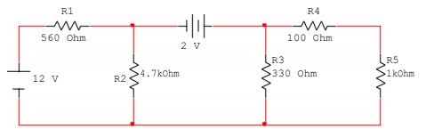
 
Figura 5.1. Circuito para comprobar el Teorema de Thévenin.

### 5.2 Mida el voltaje y la corriente en el resistor R5, anote los resultados en la tabla 5.2.

 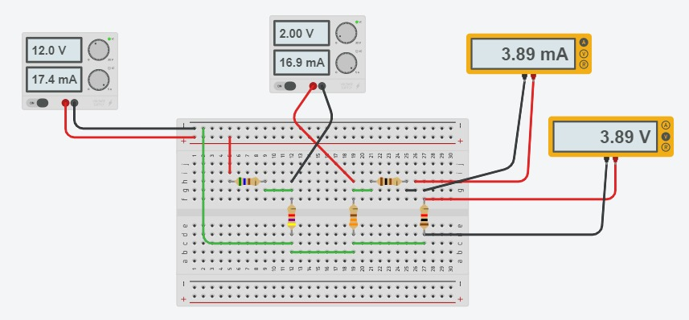
 
### 5.3 Desconecte el resistor R5 y mida el voltaje en el circuito abierto. Anote el valor medido en la tabla 5.1.

 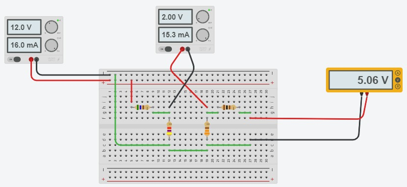

### 5.4 Anule el efecto de las fuentes de alimentación. Desconecte R5 y desde el circuito abierto resultante mida la resistencia equivalente. Anote el valor medido en la tabla 5.1.

 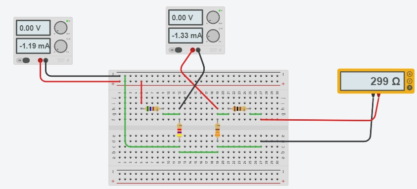

### 5.5 Implemente el circuito equivalente de Thévenin, agregue el resistor R5 y mida la corriente y el voltaje en el mismo, anote los resultados en la tabla 5.2.

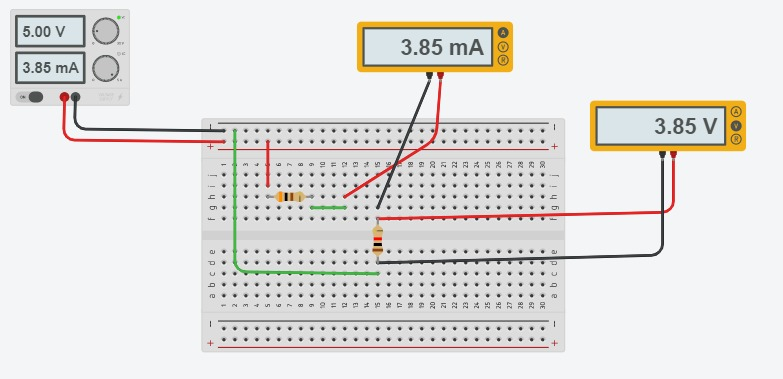
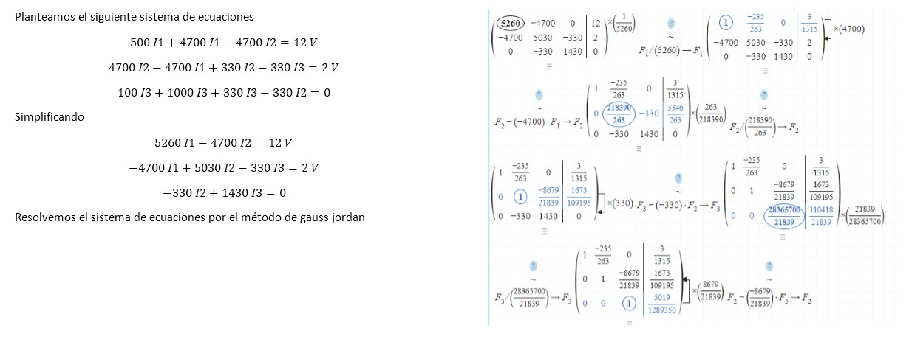
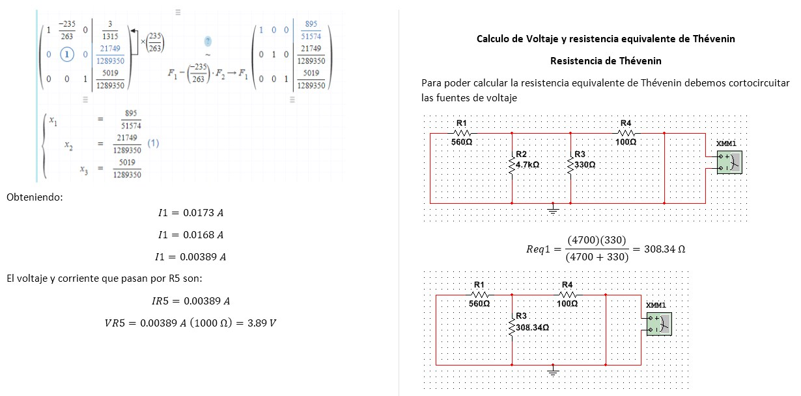
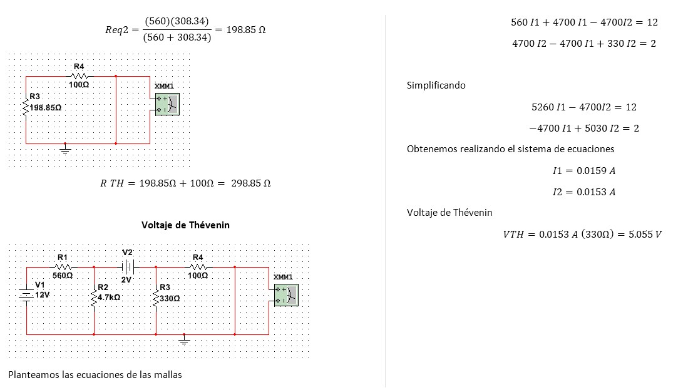
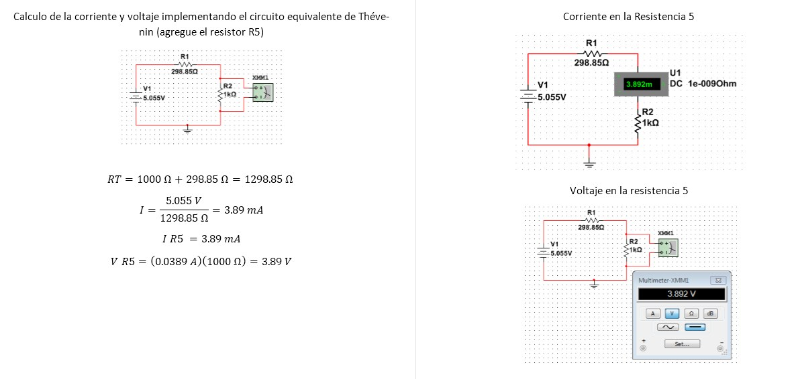

### Tabla 5.1. Valores del circuito Equivalente de Thévenin

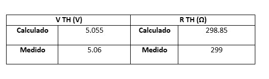

### Tabla 5.2. Comprobacion del teorema de Thévenin

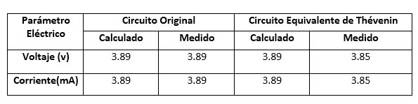

6. VIDEO

https://youtu.be/WCA4Ug-Vrbg

7. CONCLUSIONES

 - Se pudo comprobar que los valores obtenidos de los voltajes como de las corrientes fueron muy semejantes a los obtenidos mediante verificar el circuito analiticamente, con unos pequeños margenes de error.
Asi mismo tanto para las tablas obtenidas, se comprobó el uso del teorema de superposición, mediante las ecuaciones encontradas, los cálculos obtenidos nos asemejan a una silmulación real, todo este proceso de usar la ley antes mencionadas nos permiten a que los valores sean precisos y casi exactos, apoyandonos del mismo ciruito para usar las fórmulas como la dirección de los voltajes y corrientes.

8. BIBLIOGRAFIA

 Floyd Thomas L, “Principios de Circuitos Eléctricos”, 8 ed. 2007 .Pearson Educación de México, S.A. de C.V. México, pp. 281-333.
